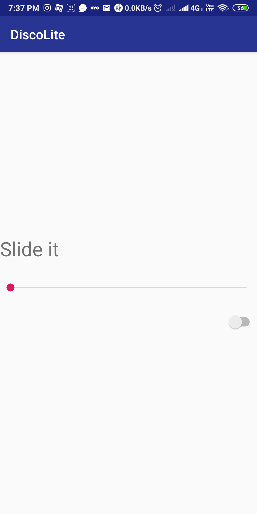

# About
### It a simple DiscoLite app.

## Screenshot

## Tech Stack
#### It uses an addition user-permission to access device flashlight using switch as shown in fig.
#### Here the seekbar is used to handle the frequency of light to make it seem like discolight.